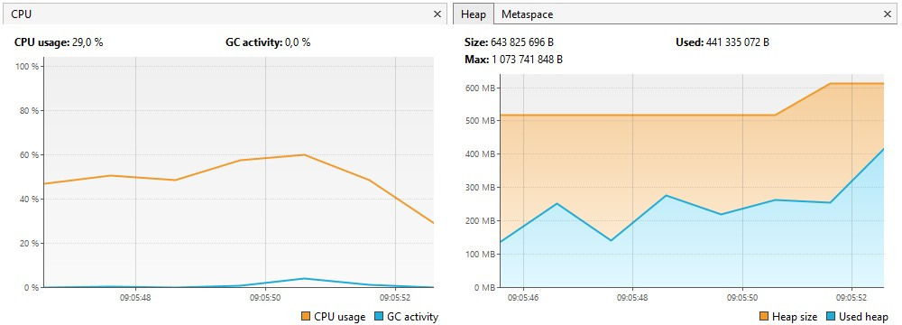

## Результаты выполнения [тестового задания Uno-Soft](https://github.com/PeacockTeam/new-job/blob/master/lng-java.md)

### Для файла `lng.txt`:
- Число групп с более чем одним элементом: **1910**;
- Время выполнения: **6 секунд**.

Скриншоты из VisualVM и терминала:
  
  

### Для файла `lng-big.csv`:
- Число групп с более чем одним элементом: **105036**;
- Время выполнения: **10 секунд**.

Скриншоты из VisualVM и терминала:
  
  
---

## Краткое описания алгоритма решения
1)	Текстовый файл считывается построчно и сохраняется в `linesList`, в котором индекс является номером группы для текущей строки;
2)	Строка делится на `Record` с указанием `value` и `index`, после чего `Record` заносится в мапу `valueGroupHashMap` с указанием группы текущей строки;
3)	Наличие каждого нового `Record` проверяется в `valueGroupHashMap`. Если он есть, то текущая группа `Record` должна будет слиться с уже имеющейся.
Таким образом, создаётся карта слияния групп `groupMergeHashMap`;
4)	Карта слияния сортируется в `sortedGroupMergeHashMap`, после чего происходит корректное слияние групп;
5)	Сортируем карту групп по убыванию и записываем получившиеся группы в файл.

## Сборка и запуск в терминале

- `mvn clean package`
- `java -jar -Xmx1G src/main/resources/uno-soft_test.jar src/main/resources/lng-big.csv`